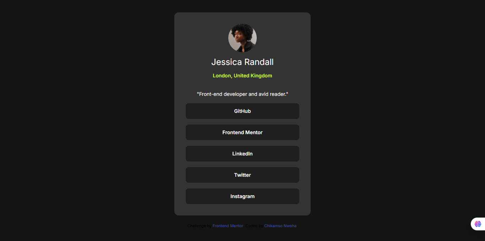

# Frontend Mentor - Social links profile

This is a solution to the [Social links profile challenge on Frontend Mentor](https://www.frontendmentor.io/challenges/social-links-profile-UG32l9m6dQ).

## Table of contents

- [Overview](#overview)
  - [The challenge](#the-challenge)
  - [Screenshot](#screenshot)
  - [Links](#links)
- [My process](#my-process)
  - [Built with](#built-with)
  - [What I learned](#what-i-learned)
  - [Continued development](#continued-development)
- [Author](#author)
- [Acknowledgments](#acknowledgments)

## Overview

### The challenge

Users should be able to:

- See hover and focus states for all interactive elements on the page

### Screenshot

### Links

### Links
- Solution URL: https://www.frontendmentor.io/solutions/social-links-profile-with-tailwind-css-abc123
- Live Site URL: https://chikamsodev.github.io/social-links-profile-main/

## My process

I started by adding the Tailwind CDN to enable Tailwind CSS. I then imported the Inter font and set the background color on the body to match the design. Using semantic HTML and Tailwind utility classes, I styled all elements according to the provided style guide. I also used CSS Grid to center the main container.

### Built with

- Semantic HTML5 markup
- Tailwind CSS
- CSS Grid
- Flexbox

### What I learned

I learned that `place-items-center` in Tailwind is equivalent to using `justify-content` and `align-items` in CSS Grid. I also learned that Tailwind does not allow spaces in arbitrary values, so colors must be written like `bg-[hsl(75,94%,57%)]`.

I am most proud of my use of semantic HTML. If I were to rate myself, I would give this project an 8 or 9 out of 10.

### Continued development

In the future, I plan to replace the profile image and buttons with my own details to turn this into a personal profile card.

## Author

- Website - [ChikamsoDev](https://chikamsodev.github.io/Personal-Portfolio/)
- Twitter - [@ChikamsoDev](https://x.com/ChikamsoDev)

## Acknowledgments

I would like to thank FreeCodeCamp, YouTube, and ChatGPT for their resources and guidance throughout my learning journey.
